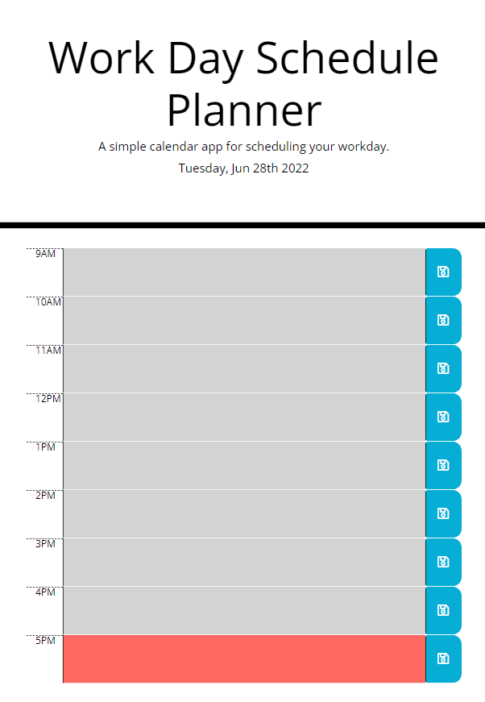

# Work Day Scheduler Starter Code
This is a simple calendar application that allows a user to save events for each hour of the day. This app runs in the browser and features bootstrap, moment.js, and dynamically updated HTML and CSS powered by jQuery.

Deployed Application: https://jroller33.github.io/Workday-Schedule-App/